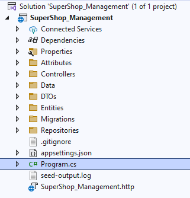

# SupplyChain-ERP-WebAPI

<div align="center">
  
  
  
  
  
</div>

---

## Executive Summary
This repository contains the core **RESTful Web API** for an enterprise-grade Supply Chain and Enterprise Resource Planning (ERP) system. Developed using **ASP.NET Core**, the system is engineered to handle complex business logic, ranging from multi-vendor procurement lifecycles to highly granular warehouse management. It serves as a secure, scalable, and centralized backend engine designed to communicate seamlessly with decoupled frontend applications (React/Angular).

## System Architecture & Design Patterns
The application follows modern software engineering principles to ensure maintainability, scalability, and loose coupling:
- **N-Tier Architecture:** Logical separation of API Controllers, Business Logic, Data Access, and Domain Entities.
- **Repository Pattern:** Abstracts the data layer, allowing central management of data access logic and simplifying unit testing.
- **Data Transfer Objects (DTOs):** Strict payload structuring to prevent over-posting and ensure that internal domain models are never directly exposed to the presentation layer.
- **Dependency Injection (DI):** Fully integrated DI container for managing the lifecycle of Repositories, DB Context, and custom services.
- **Asynchronous Processing:** Comprehensive implementation of `async/await` across all I/O bound operations to maximize thread pool utilization and server throughput.
- **Soft Deletion Mechanism:** Implemented at the repository layer to retain historical data for audit trails without cluttering active queries.

---

## Comprehensive Module Breakdown

### 1. Security, Identity & Access Management
- **Stateless Authentication:** Implemented via JSON Web Tokens (JWT) ensuring secure API communications.
- **Role-Based Access Control (RBAC):** Strict endpoint protection utilizing multi-tier user roles (Admin, Purchase Manager, Purchase Officer, Store Manager).
- **Custom Claims Integration:** Users are mapped to specific departments via JWT claims, ensuring localized data access and preventing cross-departmental data leakage.

### 2. Complete Procurement Lifecycle
- **Purchase Requisition (PR):** Internal departmental requests for raw materials or products, routed through an approval matrix.
- **Request for Quotation (RFQ) & Bidding:** Automated generation of RFQs dispatched to registered suppliers.
- **Comparative Statement (CS):** A core algorithmic module that evaluates multiple supplier quotations, applying financial logic to determine the most cost-effective bids.
- **Purchase Order (PO):** Automated PO generation linked to the approved CS, enforcing strict compliance with selected vendor rates and quantities.

### 3. Advanced Warehouse & Inventory Control
- **Granular Location Tracking:** A 7-tier hierarchical location system (`Warehouse -> Floor -> Zone -> Aisle -> Rack -> Shelf -> Bin`) for pinpoint accuracy of stock placement.
- **Goods Receipt Note (GRN) & Quality Check (QC):** Multi-step verification of incoming procurements. The QC module handles partial acceptances and rejections with automated remark logging.
- **Batch & Expiry Management:** Strict tracking mechanisms for perishable items, monitoring manufacturing dates, expiry dates, and lot numbers.
- **Stock Movement:** Dynamic APIs to handle internal transfers of stock between different warehouse bins or zones while maintaining accurate audit logs.

### 4. Store Operations & Distribution
- **Employee Requisitions:** Formal requests for internal resource allocation.
- **FIFO Store Issues:** Automated inventory deduction prioritizing First-In-First-Out logic to minimize stock depreciation and waste.
- **Threshold Monitoring:** Real-time calculation of available stock against predefined minimum thresholds, triggering alerts for the procurement team.

### 5. Master Data Management (MDM)
- Centralized administration for core entities including Products, Item Categories, Brands, Currencies, Unit Sets, and Supplier networks.

---

## Project Folder Structure



The project follows a highly decoupled directory structure:
- **Attributes:** Custom authorization and validation logic.
- **Controllers:** HTTP API Endpoints and routing logic.
- **Data & Migrations:** Entity Framework `AppDbContext` and automated schema generation files.
- **DTOs:** Request/Response payloads categorized by domain.
- **Entities & Models:** Domain-driven database entities.
- **Repositories:** Interfaces and concrete implementations for data access.

---

## Getting Started & Local Environment Setup

### Prerequisites
- .NET 6.0 / 7.0 SDK or higher
- MS SQL Server (Local or Dockerized)
- Visual Studio 2022 / JetBrains Rider / VS Code

### Installation & Execution
1. **Clone the repository:**
   ```bash
   git clone [https://github.com/Shahriar-Developer/SupplyChain-ERP-WebAPI.git](https://github.com/Shahriar-Developer/SupplyChain-ERP-WebAPI.git)
